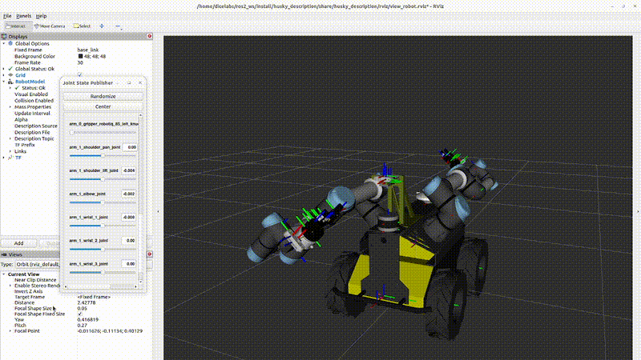

# husky_description




Modular xacro description for **Clearpath Husky A200-0876** with:

- 2 × **UR5e** arms on a custom dual-arm bulkhead
- 2 × **Robotiq 2F-85** grippers (one per arm wrist)
- **Velodyne VLP-16** 3D lidar
- 3 × **Intel RealSense D435** (2 wrist-mounted, 1 on pan-tilt neck)
- **Dynamixel 2XL430** pan-tilt servo on a custom neck mount (FR12 brackets)
- IMU and Swift GPS antenna
- Front bumper
- Optional `ros2_control` block for the Clearpath A200Hardware plugin
- Optional Gazebo (Ignition/gz) sensor plugins

---

## Layout

```
urdf/
├── robot.urdf.xacro              # top-level, composes everything
├── common/materials.xacro        # Clearpath palette + olive green
├── platform/
│   ├── a200.urdf.xacro           # base_link, inertial, mounts, chassis
│   └── wheel.urdf.xacro          # wheel macro (called x4)
├── accessories/
│   ├── bumper.urdf.xacro
│   ├── dual_arm_bulkhead.urdf.xacro
│   ├── camera_mount.urdf.xacro       # custom neck base
│   ├── fr12_bracket.urdf.xacro       # Robotis FR12-H103GM (base of pan-tilt)
│   ├── dynamixel_2xl430.urdf.xacro   # tilt joint (revolute, Y)
│   ├── fr12_h104_pan.urdf.xacro      # pan joint (revolute, Z)
│   └── neck_camera_holder.urdf.xacro # rigid camera holder on pan output
├── sensors/
│   ├── velodyne_vlp16.urdf.xacro
│   ├── realsense_d435.urdf.xacro     # show_bracket param to toggle mount bracket
│   ├── imu.urdf.xacro
│   └── gps.urdf.xacro
├── manipulators/
│   ├── ur5e.urdf.xacro
│   └── robotiq_2f_85.urdf.xacro
└── control/a200_ros2_control.xacro
```

---

## Meshes

All mesh references use `package://husky_description/meshes/...`.

Mesh folders in this package:

- `a200_0876_description/` — custom parts specific to unit 0876 (dual-arm bulkhead)
- `clearpath_platform_description/` — Husky chassis, wheels, attachments
- `clearpath_sensors_description/` — Swift GPS antenna, other sensors
- `velodyne_description/` — VLP-16 lidar
- `realsense2_description/` — RealSense D435
- `ur_description/` — UR5e arms
- `robotiq_description/` — 2F-85 gripper
- `mount_description/` — custom pan-tilt neck mount (camera_mount, FR12 brackets, 2XL430, neck holder)

> STL files for the mount must be **binary** format. If you export from FreeCAD, make sure binary is selected, or convert with `admesh -b out.stl in.stl`.

---

## Build & view

```bash
cd ~/ros2_ws
colcon build --packages-select husky_description --symlink-install
source install/setup.bash

# RViz + jsp_gui (default)
ros2 launch husky_description view_robot.launch.py

# with Gazebo plugins embedded in the URDF
ros2 launch husky_description view_robot.launch.py use_gazebo:=true

# with ros2_control block embedded
ros2 launch husky_description view_robot.launch.py use_ros2_control:=true
```

Sanity-check the xacro without launching anything:

```bash
xacro src/husky_description/urdf/robot.urdf.xacro > /tmp/robot.urdf
check_urdf /tmp/robot.urdf
```

---

## Xacro args (top level)

| arg                | default                         | purpose                                  |
|--------------------|---------------------------------|------------------------------------------|
| `use_gazebo`       | `false`                         | Emit `<gazebo>` sensor/system plugins.   |
| `use_ros2_control` | `true`                          | Emit the `<ros2_control>` block.         |
| `serial_port`      | `/dev/clearpath/prolific`       | Serial device for A200Hardware plugin.   |
